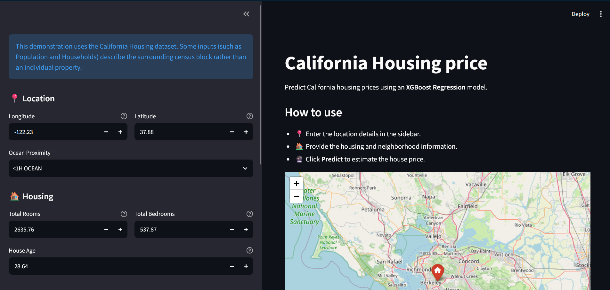

# California-Housing-Price


An **end-to-end machine learning project** that predicts California housing prices using multiple regression models, feature engineering, hyperparameter tuning, and an interactive **Streamlit** web application.

🚀 **Live Demo:** [Try the Streamlit app here](https://stream-california-housing-price.streamlit.app/)

---
## Features

- Predict California housing prices
- Interactive web interface built with Streamlit
- Interactive map
  
## Built with
- Python 3.12
- streamlit
- Scikit-learn
- Pandas
- NumPy
- Folium
- Joblib

## Installation
### 1. Clone the repository:
```bash
git clone <repository-url>
cd California-Housing-Price
```
### 2. Install dependencies
```bash
pip install -r requirement.txt
```
### 3. Run the application
```bash
streamlit run app.py
```

## Dataset

This project uses the **California Housing** dataset.

### Features

| Feature | Description |
|---------|-------------|
| Longitude | How far west a house is located |
| Latitude | How far north a house is located |
| Housing Median Age | Median age of houses within a census block |
| Total Rooms | Total number of rooms within a census block |
| Total Bedrooms | Total number of bedrooms within a census block |
| Population | Total number of people living within a census block |
| Households | Total number of households within a census block |
| Median Income | Median household income (measured in tens of thousands of US dollars) |
| Ocean Proximity | Relative location of the house to the ocean |

### Target Variable

| Target | Description |
|---------|-------------|
| Median House Value | Median house value within a census block |

---

## 📸 Application Preview



---
